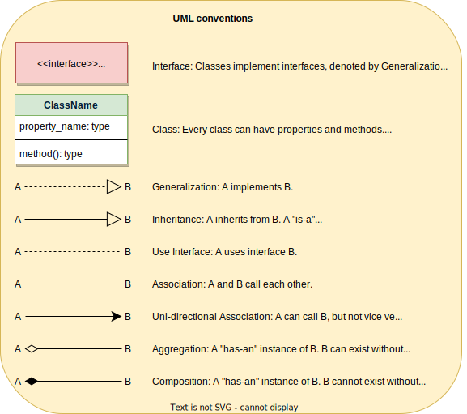

Some Java concepts

### Four Principles of OOP

The four principles of object-oriented programming are encapsulation, abstraction, inheritance, and polymorphism.

1. **Encapsulation**

How we keep the data together (in a capsule) hiding it from the outside world

2. **Abstraction**

An extension on encapsulation, where we hide everything but relevant data about the object to reduce the complexity

3. **Inheritence**

Allowing one class to inherit from its super class

4. **Polymorphism**

Having multiple forms and responding diffently in different contexts (overriding and overloading)

### Class Diagrams

Relationship between classes 

